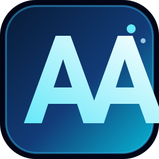

# Abdul Rehman Afzal

### Full-Stack Developer · Next.js · FastAPI · Agentic AI · Headless CMS

  

> **I turn ambitious product ideas into fast, secure, and scalable software.**

## 🧭 What I Do

I’m a **Full-Stack Developer** focused on building production-ready applications with **Next.js App Router, FastAPI, Agentic AI, and Headless CMS platforms**. I care about the details behind the interface: architecture, security, performance, accessibility, and long-term maintainability.

- 🤖 **AI-powered business tools** — LLM integrations, agent loops, tool selection, and workflow automation
- 🛒 **E-commerce and SaaS** — dynamic catalogs, dashboards, RBAC, and custom customer experiences
- 🧩 **Headless CMS platforms** — flexible content architecture with Payload CMS and Strapi
- 🔐 **Secure backend systems** — OAuth2, JWT, API protection, rate limiting, and optimized queries

## ✦ Featured Project Showcase

<!-- Replace the three placeholder links below with your real repository URLs and project names. -->

<table>
<tr>
<td width="33%" valign="top">

<h3>🤖 AI Workflow Platform</h3>

An intelligent workflow tool using LLMs, agentic loops, tool calling, and automation to reduce repetitive business work.

<b>Next.js · FastAPI · LLMs</b>

  

<a href="https://github.com/abdulrehmanafzal-webdeveloper">View project →</a>

</td>
<td width="33%" valign="top">

<h3>🛍️ Commerce Experience</h3>

A fast, conversion-focused commerce interface with dynamic products, secure accounts, and a headless content layer.

<b>Next.js · Payload · TypeScript</b>

  

<a href="https://github.com/abdulrehmanafzal-webdeveloper">View project →</a>

</td>
<td width="33%" valign="top">

<h3>📊 Business Dashboard</h3>

A role-aware internal platform with analytics, protected routes, robust forms, and actionable data visualizations.

<b>React · FastAPI · MySQL</b>

  

<a href="https://github.com/abdulrehmanafzal-webdeveloper">View project →</a>

</td>
</tr>
</table>

## 🧰 Technology Stack

### Frontend & UI

### Backend, Data & CMS

### AI, Testing & Cloud

## 🧠 Engineering Principles

| Principle | How I apply it |
| --- | --- |
| **Secure by design** | Defense-in-depth, strict validation, OAuth2/JWT, RBAC, and protected routes |
| **Built to scale** | BFF architecture, clean APIs, query optimization, caching strategies, and modular systems |
| **Quality first** | Playwright/Selenium automation, model evaluation, code reviews, and observable workflows |
| **User focused** | Accessible, responsive interfaces that make complex workflows feel simple |

## 📈 GitHub Activity

 

## 🤝 Let’s Build Something Great

I’m open to **freelance projects, collaborations, full-time opportunities, AI automation, SaaS, e-commerce, and headless CMS work**.

  

